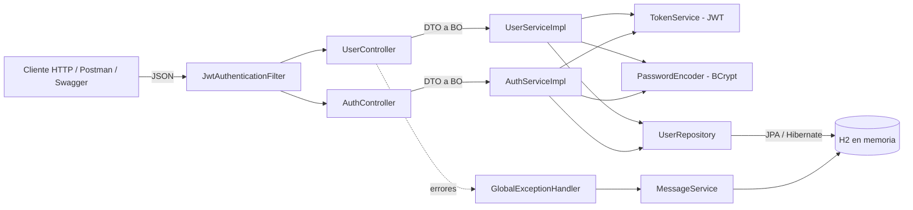
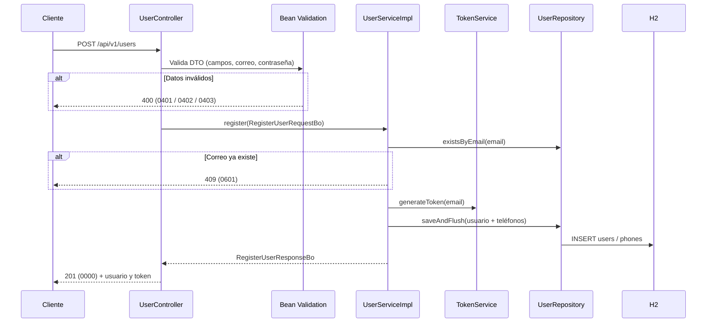
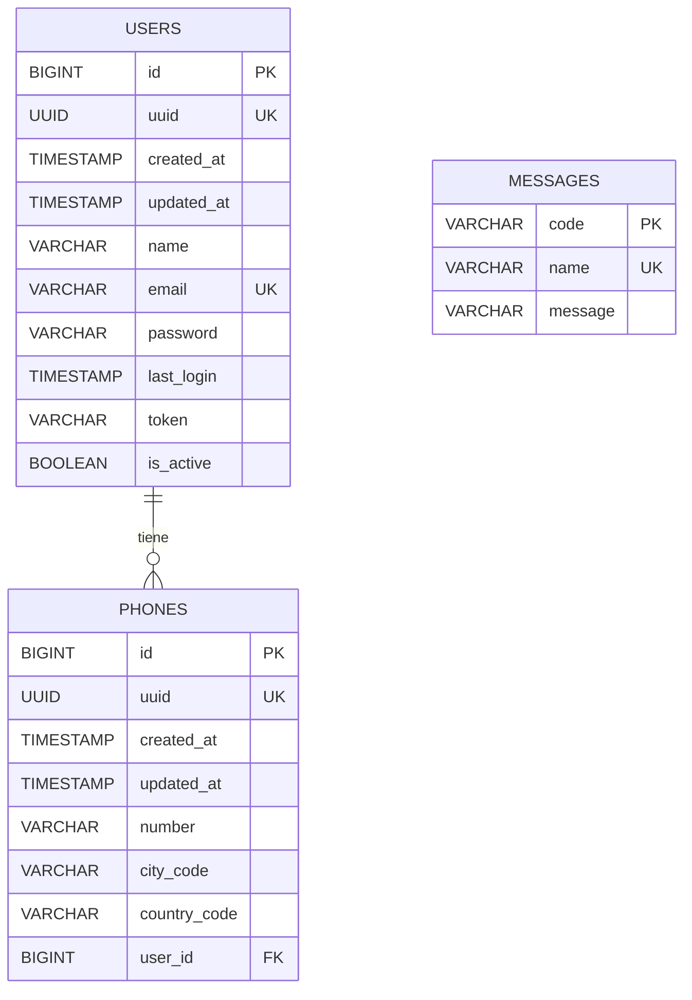

# BCI Test - API de Usuarios

API RESTful de registro de usuarios desarrollada como evaluación técnica para BCI. Expone un endpoint público de registro que retorna un token JWT persistido junto al usuario, y un endpoint protegido que valida ese token para consultar la información del usuario autenticado.

## Stack

| Componente | Versión |
|---|---|
| Java | 21 |
| Spring Boot | 4.1.1 (Web MVC, Data JPA, Validation, Security) |
| Hibernate ORM | 7.x |
| Base de datos | H2 en memoria |
| Build | Gradle 9.7.1 (wrapper incluido) |
| Token | JWT (jjwt 0.12.6, HS256) |
| Documentación | springdoc-openapi 3.0.3 (Swagger UI) |
| Utilidades | Lombok |

## Requisitos

- JDK 21
- No se necesita instalar Gradle ni una base de datos: el proyecto usa el wrapper de Gradle y H2 en memoria.

## Cómo ejecutar

```bash
./gradlew clean bootRun
```

En Windows:

```bash
gradlew.bat clean bootRun
```

La aplicación queda disponible en `http://localhost:8080/bci-test`.

### Variables de entorno

Todas son opcionales y tienen un valor por defecto.

| Variable | Descripción | Valor por defecto |
|---|---|---|
| `SERVER_PORT` | Puerto HTTP | `8080` |
| `CONTEXT_PATH` | Context path de la aplicación | `/bci-test` |
| `JWT_SECRET` | Clave Base64 (mínimo 32 bytes) para firmar los JWT | Valor de desarrollo incluido en `application.yaml` |

Ejemplo:

```bash
SERVER_PORT=9090 CONTEXT_PATH=/usuarios ./gradlew bootRun
```

### Configuración relevante (`application.yaml`)

| Propiedad | Descripción | Valor |
|---|---|---|
| `app.password.regex` | Expresión regular que debe cumplir la contraseña | `^(?=.*[A-Z])(?=.*[a-z])(?=.*\d).{8,}$` (mínimo 8 caracteres, al menos una mayúscula, una minúscula y un dígito) |
| `app.jwt.expiration-ms` | Duración del token | `3600000` (1 hora) |

La expresión regular de la contraseña es configurable: basta con cambiar `app.password.regex`, sin recompilar.

## URLs útiles

| Recurso | URL |
|---|---|
| Swagger UI | http://localhost:8080/bci-test/swagger-ui.html |
| OpenAPI (JSON) | http://localhost:8080/bci-test/v3/api-docs |
| Consola H2 | http://localhost:8080/bci-test/h2-console |
| Estado de la aplicación | http://localhost:8080/bci-test/actuator/health |
| Información de la aplicación | http://localhost:8080/bci-test/actuator/info |

Datos de conexión a la consola H2:

- JDBC URL: `jdbc:h2:mem:bcidb`
- Usuario: `sa`
- Contraseña: vacía

## Monitoreo (Actuator)

Los endpoints de Actuator son públicos y de solo lectura (`GET`). Solo se exponen `health` e `info`; cualquier otro endpoint de Actuator responde 404.

| Endpoint | Descripción |
|---|---|
| `/actuator/health` | Estado general de la aplicación (`UP` o `DOWN`). Considera la base de datos y el espacio en disco, pero no expone los detalles internos |
| `/actuator/health/liveness` | Indica si la aplicación está viva (probe de liveness para Kubernetes) |
| `/actuator/health/readiness` | Indica si la aplicación está lista para recibir tráfico (probe de readiness) |
| `/actuator/info` | Nombre y descripción de la aplicación, versión y fecha del build, versión de Java y sistema operativo |

Ejemplo de `/actuator/health`:

```json
{ "status": "UP", "groups": ["liveness", "readiness"] }
```

## Endpoints

| Método | Ruta | Autenticación | Descripción |
|---|---|---|---|
| `POST` | `/api/v1/users` | Pública | Registra un usuario y retorna sus datos con el token |
| `POST` | `/api/v1/auth/login` | Pública | Valida las credenciales y emite un token nuevo |
| `GET` | `/api/v1/users/me` | `Authorization: Bearer <token>` | Retorna la información del usuario dueño del token |

### Registro de usuario

```bash
curl -i -X POST http://localhost:8080/bci-test/api/v1/users \
  -H "Content-Type: application/json" \
  -d '{
    "name": "Juan Rodriguez",
    "email": "juan@rodriguez.org",
    "password": "Hunter22",
    "phones": [
      { "number": "1234567", "citycode": "1", "contrycode": "57" }
    ]
  }'
```

Respuesta `201 Created`:

```json
{
  "code": "0000",
  "mensaje": "Operación realizada con éxito",
  "status": "SUCCESS",
  "data": {
    "id": "3f6b2c8e-5a1d-4e7b-9c2f-8d1a6e4b7c90",
    "name": "Juan Rodriguez",
    "email": "juan@rodriguez.org",
    "phones": [
      { "number": "1234567", "citycode": "1", "contrycode": "57" }
    ],
    "created": "2026-10-07T10:15:30.123456",
    "modified": "2026-10-07T10:15:30.123456",
    "last_login": "2026-10-07T10:15:30.123456",
    "token": "eyJhbGciOiJIUzI1NiJ9...",
    "isactive": true
  }
}
```

> La contraseña del ejemplo del enunciado (`hunter2`) no cumple la expresión regular configurada (no tiene mayúscula y tiene menos de 8 caracteres). Por eso los ejemplos usan `Hunter22`.

### Inicio de sesión

El token vence según `app.jwt.expiration-ms` (1 hora por defecto). Para obtener uno nuevo se usa el login, que además actualiza `last_login` y `modified`. Cada login invalida el token anterior.

```bash
curl -i -X POST http://localhost:8080/bci-test/api/v1/auth/login \
  -H "Content-Type: application/json" \
  -d '{ "email": "juan@rodriguez.org", "password": "Hunter22" }'
```

Responde `200 OK` con la misma estructura del registro (usuario y token nuevo). Si el correo no existe o la contraseña es incorrecta, responde `401` con el código `0503` y el mensaje "Usuario o contraseña incorrectos", sin indicar cuál de los dos falló.

### Información del usuario autenticado

```bash
curl -i http://localhost:8080/bci-test/api/v1/users/me \
  -H "Authorization: Bearer <token>"
```

Respuesta `200 OK`:

```json
{
  "code": "0000",
  "mensaje": "Operación realizada con éxito",
  "status": "SUCCESS",
  "data": {
    "id": "3f6b2c8e-5a1d-4e7b-9c2f-8d1a6e4b7c90",
    "name": "Juan Rodriguez",
    "email": "juan@rodriguez.org",
    "phones": [
      { "number": "1234567", "citycode": "1", "contrycode": "57" }
    ],
    "created": "2026-10-07T10:15:30.123456",
    "modified": "2026-10-07T10:15:30.123456",
    "last_login": "2026-10-07T10:15:30.123456",
    "isactive": true
  }
}
```

Si el token tiene firma inválida, está mal formado o expiró, responde `401` con el código `0502`. Sin token, o con un token que no es el último emitido para el usuario, responde `401` con el código `0501`.

### Ejemplo de error

```json
{
  "code": "0601",
  "mensaje": "El correo ya está registrado",
  "status": "ERROR"
}
```

## Validaciones

| Regla | Dónde | Código | HTTP |
|---|---|---|---|
| `name`, `email` y `password` son obligatorios | `@NotBlank` en el DTO | `0401` | 400 |
| Cada teléfono debe tener `number`, `citycode` y `contrycode` | `@NotBlank` en `PhoneInfoDto` | `0401` | 400 |
| El correo debe tener formato válido (`aaaaaaa@dominio.cl`) | `@Pattern` en el DTO | `0402` | 400 |
| La contraseña debe cumplir la expresión regular configurable | Validador propio `@ValidPassword` | `0403` | 400 |
| El cuerpo debe ser un JSON válido | `GlobalExceptionHandler` | `0404` | 400 |
| Largo máximo: `name` 100, `email` 150, `password` 72, `number` 20, `citycode` y `contrycode` 10 | `@Size` en los DTOs, alineado con `schema.sql` | `0405` | 400 |
| El correo no puede estar registrado | Service y restricción `UNIQUE` en la BD | `0601` | 409 |

El correo se normaliza (sin espacios y en minúsculas) antes de validar duplicados y guardar.

## Formato de respuesta y códigos de negocio

Todas las respuestas, incluidas las de error, son JSON con la siguiente estructura:

| Campo | Descripción |
|---|---|
| `code` | Código de negocio de 4 dígitos |
| `mensaje` | Mensaje legible, cargado desde la tabla `messages` |
| `status` | `SUCCESS` o `ERROR` |
| `data` | Contenido de la respuesta (solo en casos de éxito con datos) |

El enunciado define el formato `{"mensaje": "..."}`. Se mantiene el campo `mensaje` y se agregan `code` y `status` para que el cliente pueda distinguir el tipo de error sin depender del texto.

Los errores provocados por el cliente siempre responden 4xx: además de las validaciones propias, `GlobalExceptionHandler` extiende `ResponseEntityExceptionHandler` de Spring, de modo que los errores del framework (ruta inexistente, método no permitido, tipo de contenido no soportado, entre otros) responden con su status correcto y el formato de la API. La API nunca responde 500: los errores inesperados del servidor (por ejemplo, la base de datos no disponible o una falla no controlada) responden 503 con el código `9999` y se registran en el log con su stack trace.

El status HTTP no se guarda junto al código de negocio: lo decide la capa web. En los casos de éxito lo define cada endpoint (201 en el registro y 200 en el resto). En los errores lo define `GlobalExceptionHandler` según el tipo de error y, para las excepciones de negocio, según la familia del código (`04XX` → 400, `05XX` → 401, `06XX` → 409, `07XX` → 404). Los errores de seguridad responden 401.

Los textos de los mensajes viven en la tabla `messages` y se cargan en memoria al iniciar. Si un código definido en `MessageCodeType` no existe en la tabla, la aplicación no arranca.

| Familia | Rango | Código | Descripción | HTTP |
|---|---|---|---|---|
| Éxito | `00XX` | `0000` | Operación realizada con éxito | 200 / 201 |
| Validación de entrada | `04XX` | `0400` | Datos de la solicitud no válidos | 400 |
| | | `0401` | Campo obligatorio | 400 |
| | | `0402` | Formato de correo inválido | 400 |
| | | `0403` | Contraseña no cumple el formato | 400 |
| | | `0404` | JSON mal formado | 400 |
| | | `0405` | Campo excede el largo máximo | 400 |
| | | `0406` | Método HTTP no permitido | 405 |
| | | `0407` | Tipo de contenido no soportado | 415 |
| Estado inválido | `05XX` | `0501` | Token inválido, expirado o ausente | 401 |
| | | `0502` | El token es inválido o ha expirado | 401 |
| | | `0503` | Usuario o contraseña incorrectos | 401 |
| Duplicidad | `06XX` | `0600` | Registro duplicado | 409 |
| | | `0601` | El correo ya está registrado | 409 |
| Inconsistencia de datos | `07XX` | `0701` | Recurso o ruta no encontrada | 404 |
| Error interno | `99XX` | `9999` | Error interno o servicio no disponible | 503 |

## Seguridad y token

- El token es un JWT firmado con HS256 que contiene el correo del usuario como `subject`, un identificador único (`jti`) y una expiración.
- El token se emite al registrarse y en cada login, y se persiste junto al usuario. El filtro `JwtAuthenticationFilter` valida la firma, la expiración, que el usuario esté activo y que el token recibido sea el último emitido para ese usuario.
- La contraseña se almacena con hash BCrypt, nunca en texto plano. Su largo máximo es 72 caracteres, el límite de BCrypt.
- La API es stateless: no usa sesión HTTP ni CSRF.
- El identificador expuesto en la API es un UUID. El `id` numérico interno nunca se expone.

## Diagrama de la solución

### Componentes



### Secuencia del registro



## Modelo de datos

El script de creación está en `src/main/resources/schema.sql` y los datos iniciales (mensajes) en `src/main/resources/data.sql`. Ambos se ejecutan al iniciar la aplicación. Hibernate solo valida que las entidades coincidan con el esquema (`ddl-auto: validate`).



## Estructura del proyecto

```
src/main/java/cl/bci/test
├── config          Configuración de Spring Security y OpenAPI
├── controller      UserController, AuthController, BaseController y GlobalExceptionHandler
│   └── dto         DTOs de request y response de la API
├── domain          Constantes de rutas
├── enums           MessageCodeType, ResponseStatusType
├── exception       BusinessException, EmailAlreadyExistsException, SecurityException, InvalidTokenException, InvalidCredentialsException
├── persistence
│   ├── model       Entidades JPA (BaseEntity, UserEntity, PhoneEntity, MessageEntity)
│   └── repository  Repositorios Spring Data JPA
├── security        Filtro JWT, entry point 401 e implementación del TokenService
├── service         Interfaces de servicio
│   ├── bo          Objetos de negocio
│   ├── impl        Implementaciones (UserServiceImpl, AuthServiceImpl, MessageServiceImpl)
│   └── mapper      Conversión entre entidades y objetos de negocio
├── util            MapperUtil (conversión DTO a BO y viceversa)
└── validation      Validador de contraseña (@ValidPassword)
```

## Probar con Postman

El proyecto incluye la colección `postman/bci-test.postman_collection.json` con 115 requests y pruebas automáticas: registro exitoso y sus variantes (cada registro guarda su token y lo usa en `/me` para validar que los datos persistidos coinciden con los enviados), campos obligatorios, formato de correo y contraseña, cuerpo mal formado, seguridad del token (ausente, alterado, expirado, firmado con otra clave, algoritmo `none`, no vigente), login (token nuevo, invalidación del anterior y credenciales incorrectas), rutas públicas (Swagger y Actuator), errores de plataforma (404, 405 y 415) y largos máximos de cada campo. Además, valida en cada respuesta el formato `code`, `mensaje` y `status`.

Para ejecutarla:

1. Importar en Postman los dos archivos de la carpeta `postman`: la colección y el ambiente `bci-test.postman_environment.json`.
2. Seleccionar el ambiente **BCI Test - Local**.
3. Correr la colección completa con el Collection Runner, en orden. La carpeta `01 - Flujo principal` registra el usuario y guarda el token, y las demás dependen de ella.

Variables del ambiente:

| Variable | Valor por defecto | Descripción |
|---|---|---|
| `bci-test-hostname` | `http://localhost` | Protocolo y host |
| `bci-test-port` | `:8080` | Puerto, con los dos puntos |
| `bci-test-context-path` | `/bci-test` | Debe coincidir con `CONTEXT_PATH` |
| `bci-test-jwt-secret` | Clave de desarrollo | Debe coincidir con `JWT_SECRET`; se usa para generar tokens de prueba |

Las URLs de la colección siguen la estructura `{{bci-test-hostname}}{{bci-test-port}}{{bci-test-context-path}}/api/v1/users`.

Para probar manualmente:

1. Crear una petición `POST {{bci-test-hostname}}{{bci-test-port}}{{bci-test-context-path}}/api/v1/users` con el body del ejemplo de registro.
2. En la pestaña **Scripts > Post-response** de esa petición, agregar:

   ```javascript
   const json = pm.response.json();

   if (pm.response.code === 201 && json?.data?.token) {
       pm.collectionVariables.set("bci-test-user-jwt", json.data.token);
   }
   ```

3. Crear una petición `GET {{bci-test-hostname}}{{bci-test-port}}{{bci-test-context-path}}/api/v1/users/me` con **Authorization > Bearer Token** y el valor `{{bci-test-user-jwt}}`.


## Pruebas

```bash
./gradlew test
```

Las pruebas unitarias usan JUnit 5 y Mockito: cada componente se prueba aislado, con sus dependencias simuladas. La prueba de integración levanta la aplicación completa con la seguridad real y H2.

| Clase | Tipo | Qué valida |
|---|---|---|
| `UserServiceImplTest` | Unitaria (Mockito) | Registro con normalización de datos, hash y token; registro sin teléfonos; correo duplicado; consulta y usuario inexistente |
| `AuthServiceImplTest` | Unitaria (Mockito) | Login con token nuevo y actualización de `last_login`; contraseña incorrecta; correo inexistente; usuario inactivo |
| `MessageServiceImplTest` | Unitaria (Mockito) | Carga de mensajes, reemplazo de argumentos y fallo al iniciar si falta un código en la tabla |
| `UserControllerTest` | Unitaria (Mockito) | Conversión de DTO a BO y de BO a DTO en el registro y en `/me`, y código de éxito |
| `AuthControllerTest` | Unitaria (Mockito) | Conversión en el login y propagación de credenciales inválidas |
| `GlobalExceptionHandlerTest` | Unitaria (Mockito) | Código y status HTTP de cada tipo de error: validación, JSON mal formado, 404, 405, 415, 409, 401 y 503 |
| `JwtAuthenticationFilterTest` | Unitaria (Mockito) | Autenticación con token vigente; sin header; otros esquemas; token no vigente; usuario inactivo o inexistente; token inválido |
| `JwtAuthenticationEntryPointTest` | Unitaria (Mockito) | Respuesta 401 con `0501` por defecto y con `0502` cuando el filtro detecta un token inválido |
| `PasswordValidatorTest` | Unitaria (Mockito) | Contraseñas válidas, inválidas y vacías |
| `JwtTokenServiceImplTest` | Unitaria | Generación y validación del JWT; token mal formado, vacío, firmado con otra clave y expirado |
| `UserApiIntegrationTest` | Integración (MockMvc, seguridad real y H2) | Flujo completo de la API: registro, validaciones, duplicado, 415, 405, 404, `/me` con y sin token, login e invalidación del token anterior, y Actuator (`health` e `info` públicos, el resto no expuesto) |

## Zona horaria

La aplicación fija la zona horaria `America/Santiago` al iniciar, de modo que las fechas `created`, `modified` y `last_login` se generan y serializan en hora de Chile.
